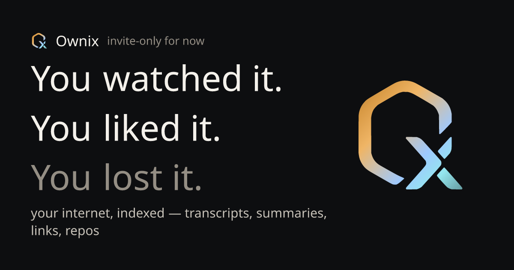

# Ownix — Your internet, indexed



Telegram bot that processes short videos, long videos, Github URLs, dev articles, and PDF documents into structured AI analysis, stores everything in Google Drive + Sheets + GCS, and builds a searchable semantic Second Brain — with a Next.js web dashboard for browsing the results. (Backend codename: `vig` — Video Intelligence Gateway.)

---

## Features

- **Short video pipeline** — YouTube Shorts, Instagram Reels, TikTok: frame extraction → Gemini Vision analysis → Brave Search link verification → Drive upload
- **Long video pipeline** — YouTube: transcript extraction → Drive upload → Gemini enrichment (topic, objective, action points, tools, promise-gap) → optional Mini-PRD spec generation
- **Article pipeline** — Substack, Medium, dev.to, Ghost, Hashnode + per-chat allowlist: Jina Reader fetch → markdown cache → paywall heuristic → Gemini analysis → Sheets → Brain
- **Repo pipeline** — `github.com/<owner>/<repo>` URLs: GitHub API bundle (README + prioritized file tree + package manifests + stars/forks/language) → Gemini 2.5 Flash structured analysis (tagline, tech stack, developer use-cases, educational concepts + file-pointed curriculum hooks) → `.md` document → Sheets → Brain. Handles archived repos and missing-README repos; gists and enterprise hosts are rejected
- **Document pipeline** — PDF documents (file upload or `.pdf` URL): liteparse text extraction → content-addressed GCS cache (`parsed/<sha>.txt`) → Gemini enrichment (title, author, document type, key points, references, tools) → Telegram delivery (parsed `.txt` + enrichment summary)
- **Photo OCR** — Screenshot link extraction with verbatim-grounded anti-hallucination filter; multi-image sends are auto-batched via Telegram's `media_group_id` (no command needed) into one unified result
- **Second Brain** — Semantic link graph (Gemini embeddings + NumPy cosine similarity) searchable via `/find`
- **Mini-PRD** — AI-generated product specs from long-video transcripts; two slots: auto (Flash) and intent (Pro, user-directed)
- **Web dashboard** — "The Operator's Console": a Next.js 14 (App Router) operator UI under `web/` for browsing processed jobs (feed with per-type tabs + server-resolved thumbnails), the brain link graph, spaces, prompts, and per-job detail views

---

## Requirements

- Docker + Docker Compose
- Python 3.11+ (for the transcript sidecar, run on host)
- Telegram bot token
- Google Cloud project with Drive + Sheets + Cloud Storage APIs enabled (OAuth credentials + optional service account)
- Gemini API key (free tier sufficient for personal use)

Optional: `BRAVE_API_KEY` (link verification), `GITHUB_TOKEN` (repo pipeline + higher GitHub rate limit), `JINA_API_KEY` (Jina quota), `GEMINI_PAID_API_KEY` (fallback), `GOOGLE_STORAGE_BUCKET` (document pipeline).

---

## Setup

### 1. Clone and configure

```Shell
git clone https://github.com/Leon-87-7/ownix
cd ownix
cp .env.example .env
```

Fill in `.env`. Required fields:

```env
TELEGRAM_BOT_TOKEN=
TELEGRAM_WEBHOOK_SECRET=
WEBHOOK_URL=                        # public HTTPS base (e.g. ngrok URL)
REDIS_URL=redis://redis:6379/0

GEMINI_FREE_API_KEY=

GOOGLE_OAUTH_CLIENT_ID=
GOOGLE_OAUTH_CLIENT_SECRET=
GOOGLE_OAUTH_REFRESH_TOKEN=

GOOGLE_DRIVE_FOLDER_SHORT=
GOOGLE_DRIVE_FOLDER_LONG=
GOOGLE_DRIVE_FOLDER_BRAIN=
GOOGLE_SHEETS_ID=                   # single workbook with 5 tabs
```

See `.env.example` for the full list.

### 2. Start the transcript sidecar (host machine)

```Shell
pip install flask waitress yt-dlp youtube-transcript-api Pillow
python transcript_server.py          # listens on :5151
```

### 3. Start the main services

```Shell
docker-compose up -d
```

### 4. Register the Telegram webhook

```Shell
curl -X POST "https://api.telegram.org/bot<TOKEN>/setWebhook" \
     -d "url=<WEBHOOK_URL>/webhook" \
     -d "secret_token=<TELEGRAM_WEBHOOK_SECRET>"
```

### 5. Verify

```Shell
curl https://your-domain.com/health    # → {"status":"ok"}
```

---

## Bot Commands

| Command                   | Description                                                   |
| ------------------------- | ------------------------------------------------------------- |
| `<url>`                   | Auto-detected pipeline: short video / long video / article    |
| `/find <query>`           | Semantic search across Second Brain                           |
| `/freestyle <url>`        | Process URL with a custom Gemini prompt                       |
| `/force <url>`            | Bypass dedup + invalidate markdown cache, reprocess           |
| `/spec <suffix> [intent]` | Generate Mini-PRD for a job (last 4 chars of job ID)          |
| `/cancel`                 | Clear armed chat state (awaiting_freestyle / awaiting_intent) |
| `/allowlist <domain>`     | Add domain to article pipeline for this chat                  |
| `/unallowlist <domain>`   | Remove domain from allowlist                                  |
| `/allowlist_list`         | Show this chat's custom domains                               |
| `/download_md <url>`      | Fetch any URL as clean Markdown via Jina (no job created)     |
| `/ignore <domain>`        | Block domain from short-video link extraction                 |
| `/rebuild-graph`          | Recompute all Second Brain Obsidian `.md` nodes               |

Plain-text shortcuts work for most commands — `find <query>` is equivalent to `/find <query>`. Screenshots no longer need batch commands — send several at once and they're grouped automatically.

---

## Architecture

```
Telegram User
      │ HTTPS POST /webhook
      ▼
FastAPI :8000  ─── detect_pipeline ──► create_job ──► Redis LPUSH
      │                                                    │
      │ (photo messages are inline — no queue)             ▼
      │                                            Worker (asyncio)
      │                                              │ BRPOP
      │                                              ├─ "video" short → frames → Gemini Vision
      │                                              ├─ "video" long  → transcript → Drive
      │                                              ├─ "article"     → Jina → Gemini
      │                                              ├─ "repo"        → GitHub bundle → Gemini
      │                                              ├─ "document"    → liteparse → GCS cache → Gemini
      │                                              ├─ "enrichment"  → Gemini text
      │                                              └─ "prd_*"       → Gemini PRD

State:   SQLite WAL  ─── jobs, links, chat_state, markdown_cache, allowed_domains
Queue:   Redis FIFO  ─── survives restarts, supports multiple workers
Brain:   text-embedding-004 → NumPy similarity → Drive Obsidian vault
Sheets:  5 tabs: YouTube Transcript Index | Short Video Analysis | Article Analysis | Repo Analysis | mini PRD
```

### URL routing

`detect_pipeline(url, extra_domains)` in `src/utils/validators.py`:

| Pattern                                                              | Pipeline |
| -------------------------------------------------------------------- | -------- |
| `youtube.com/shorts/`, `instagram.com/reel/`, `tiktok.com/@*/video/` | short    |
| `youtube.com/watch`, `youtu.be/`                                     | long     |
| `github.com/<owner>/<repo>` (gists / enterprise hosts rejected)      | repo     |
| any URL with path ending `.pdf`                                      | document |
| host in `ARTICLE_DEFAULT_DOMAINS` or per-chat `allowed_domains`      | article  |
| anything else                                                        | rejected |

### Job status FSM

```
pending → processing → transcript_done → enriching → done
                    ↘                              ↗
                     (short / article / document: no intermediate states)
                error (retryable via user button or /force)
```

---

## Development

```Shell
# Install dependencies
pip install -r requirements.txt

# Run tests
pytest -q                    # 159 tests

# Run a single test file
pytest tests/test_article_pipeline.py -v

# Integration tests (hit real Gemini API)
RUN_INTEGRATION=1 pytest tests/ -v

# Lint
ruff check src/
```

### Web dashboard (`web/`)

```Shell
cd web
npm install
npm run dev                  # Next.js dev server
npm test                     # Vitest (watch) — or test:run / test:coverage
```

### Database migrations

Migrations run automatically at startup via `PRAGMA user_version`. The migration table is in `src/database.py` (`_MIGRATIONS`). Each step is either a list of SQL statements (idempotent `ALTER TABLE` / `CREATE TABLE IF NOT EXISTS`) or an async callable for operations that need dynamic introspection (e.g. the v5→v6 content_type CHECK expansion).

To inspect the current schema version:

```Shell
sqlite3 data/jobs.db "PRAGMA user_version;"
```

### Adding a new pipeline

1. Add the new `content_type` value to the CHECK constraint in `SCHEMA_SQL` and write a migration step
2. Add detection logic to `detect_pipeline` in `src/utils/validators.py`
3. Create `src/processors/<type>.py` with `async def run(job: dict) -> None`
4. Add a task discriminator in `src/worker.py`
5. Route the task type in `src/telegram/webhook.py` (main URL handler + `/force` + `/freestyle`)

---

## Configuration Reference

All env vars are validated at startup by `src/config.py` (pydantic-settings). Missing required vars crash the process before the first request.

| Variable                                      | Required | Description                                         |
| --------------------------------------------- | -------- | --------------------------------------------------- |
| `TELEGRAM_BOT_TOKEN`                          | ✅       | Bot token from @BotFather                           |
| `TELEGRAM_WEBHOOK_SECRET`                     | ✅       | Random secret for webhook validation                |
| `WEBHOOK_URL`                                 | ✅       | Public HTTPS base URL                               |
| `REDIS_URL`                                   | ✅       | Redis connection string                             |
| `DB_PATH`                                     | ✅       | SQLite file path (default: `/app/data/jobs.db`)     |
| `GEMINI_FREE_API_KEY`                         | ✅       | Primary Gemini key                                  |
| `GEMINI_PAID_API_KEY`                         | —        | Fallback Gemini key on rate limit                   |
| `GOOGLE_OAUTH_CLIENT_ID/SECRET/REFRESH_TOKEN` | ✅       | Drive + Sheets OAuth                                |
| `GOOGLE_SHEETS_ID`                            | ✅       | Single consolidated workbook (5 tabs)               |
| `GOOGLE_DRIVE_FOLDER_SHORT/LONG/BRAIN`        | ✅       | Drive folder IDs                                    |
| `GOOGLE_DRIVE_FOLDER_PRD`                     | —        | PRD output folder (Mini-PRD disabled if absent)     |
| `BRAVE_API_KEY`                               | —        | Brave Search (link verification disabled if absent) |
| `GITHUB_TOKEN`                                | —        | GitHub API for the repo pipeline + `/find` enrichment (higher rate limit) |
| `JINA_API_KEY`                                | —        | Jina Reader (works without key, higher quota with)  |
| `BRAIN_MIN_SCORE`                             | —        | Cosine similarity floor for `/find` (default: 0.5)  |
| `PRD_MAX_TRANSCRIPT_CHARS`                    | —        | PRD transcript cap (default: 60000)                 |
| `PRD_INTENT_COOLDOWN_SECONDS`                 | —        | Cooldown between intent PRD re-runs (default: 15)   |
| `GOOGLE_STORAGE_BUCKET`                       | —        | GCS bucket for document pipeline (document pipeline disabled if absent) |
| `GOOGLE_SERVICE_ACCOUNT_JSON`                 | —        | Service-account key file (GCS auth; falls back to OAuth) |

---

## Google APIs Setup

### OAuth (Drive + Sheets)

The bot uses OAuth with a refresh token — no service account needed for personal Google accounts.

1. Create a project in [Google Cloud Console](https://console.cloud.google.com)
2. Enable Drive API v3 and Sheets API v4
3. Create OAuth 2.0 credentials (Desktop app type)
4. Run the auth flow once to get a refresh token
5. Set `GOOGLE_OAUTH_CLIENT_ID`, `GOOGLE_OAUTH_CLIENT_SECRET`, `GOOGLE_OAUTH_REFRESH_TOKEN`

### Sheets workbook

Create one Google Sheet with five tabs named exactly:

- `YouTube Transcript Index`
- `Short Video Analysis`
- `Article Analysis`
- `Repo Analysis`
- `mini PRD`

Set `GOOGLE_SHEETS_ID` to the spreadsheet ID from the URL.

---

## Deployment

### Docker Compose (production)

```Shell
docker-compose up -d --scale worker=2   # 2 workers, 1 API container
```

The transcript sidecar (`transcript_server.py`) runs on the host. Set `TRANSCRIPT_SERVICE_URL` and `FRAME_SERVICE_URL` to point to it.

### Logs

```Shell
docker-compose logs -f worker   # structured JSON via structlog

# Query errors
docker-compose logs worker | jq 'select(.level=="error")'

# Track a specific job
docker-compose logs worker | jq 'select(.job_id=="20260528_143022_A3F9")'
```

---

## Project Structure

```
src/
├── main.py              # FastAPI app, APScheduler (brain refresh Sun/Wed 09:00 UTC)
├── worker.py            # Task dispatch loop, boot-time reapers
├── database.py          # SQLite schema + PRAGMA migrations + all CRUD
├── brain.py             # Second Brain: ingest / search / rebuild / refresh
├── queue.py             # Redis brpop/lpush wrapper
├── config.py            # pydantic-settings, all env vars
├── processors/
│   ├── short_video.py   # Frames → Vision → Brave → Drive + transcript tail
│   ├── long_video.py    # Transcript + metadata → Drive → Phase 1
│   ├── enrichment.py    # Gemini text enrichment, Phase 2
│   ├── prd.py           # Mini-PRD: run_auto / run_intent / run_auto_resend
│   ├── article.py       # Jina → cache → paywall → Gemini → Sheets → Brain
│   ├── repo.py          # GitHub bundle → Gemini structured analysis → Sheets → Brain
│   └── document.py      # PDF parse (liteparse) → GCS cache → Gemini enrichment
├── services/
│   ├── gemini_client.py # free→paid fallback, GeminiUnavailableError
│   ├── gemini.py        # Vision + resolve_tool_urls
│   ├── gemini_photo.py  # Photo link extraction (verbatim-grounded)
│   ├── jina.py          # Jina Reader client, JinaFetchError
│   ├── drive.py         # Drive upload + update
│   ├── sheets.py        # Sheets append (5 tabs) + article in-place update
│   ├── github.py        # GitHub metadata + Redis cache
│   ├── google_auth.py   # Shared Google OAuth / service-account credentials
│   ├── job_recovery.py  # Dashboard-triggered job recovery orchestration
│   ├── storage.py       # GCS content-addressed blob store (document pipeline)
│   ├── parse.py         # liteparse PDF text extraction
│   ├── frames.py        # /short_frames sidecar client
│   ├── transcript.py    # /transcript + /metadata sidecar clients
│   └── brave.py         # Brave Search client
├── telegram/
│   ├── webhook.py       # POST /webhook — URL routing, chat_state FSM, dispatch tables
│   └── sender.py        # sendMessage, sendDocument, sendPhoto, ForceReply, inline keyboard
├── utils/
│   ├── validators.py    # detect_pipeline, ARTICLE_DEFAULT_DOMAINS, extract_description_links
│   ├── markdown.py      # build_links_message, build_enriched_links_message
│   └── logger.py        # structlog JSON config
├── templates.py         # PROMPT_TEMPLATES registry (summary/method/technical/review/narrative)
├── analysis.py          # extract_key_phrases (enrichment KEY CONTEXT block)
└── validation.py        # validate_template_choice (mismatch warning)

tests/                   # pytest + pytest-asyncio (159 tests)
transcript_server.py     # Flask+Waitress sidecar :5151 (yt-dlp + ffmpeg + youtube-transcript-api)
docker-compose.yml
.env.example

web/                     # Next.js 14 dashboard — "The Operator's Console"
├── app/                 # feed (home), brain, spaces, prompts, controls, jobs/[id], login
├── components/          # PlatformIcon, job cards, sidebar rail/drawer, VIG branding
├── lib/                 # useFeedData + job-detail utilities
└── *.test.tsx           # Vitest + React Testing Library + MSW
```

---

## Further Reading

- [`docs/seed/README.md`](docs/seed/README.md) — portfolio narrative: why it was built this way, key decisions, complexity notes
- [`docs/seed/ARCHITECTURE.md`](docs/seed/ARCHITECTURE.md) — system diagrams, pipeline sequence diagrams, component map
- [`docs/seed/TECHSTACK.md`](docs/seed/TECHSTACK.md) — tech choices with rationale and switch conditions
- [`docs/seed/MODULE_MAP.md`](docs/seed/MODULE_MAP.md) — module-level call graph
- [`CLAUDE.md`](CLAUDE.md) — agent and contributor instructions

---

## License

MIT
