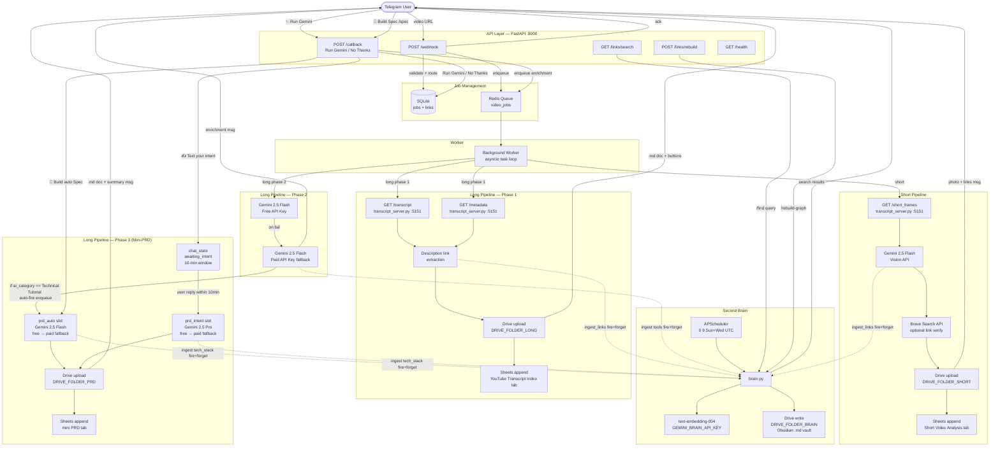
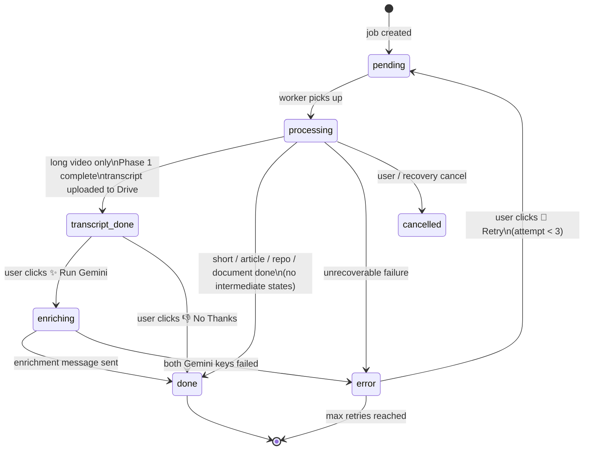
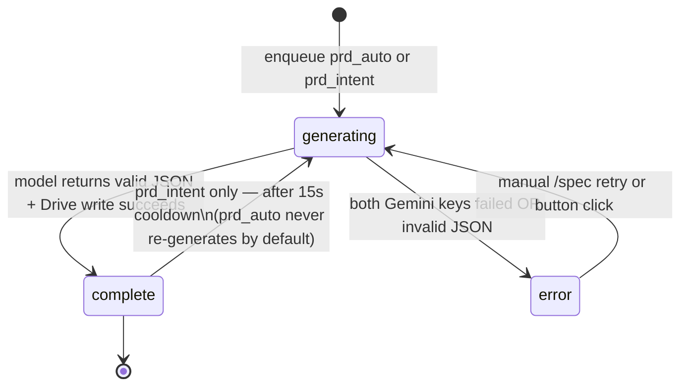
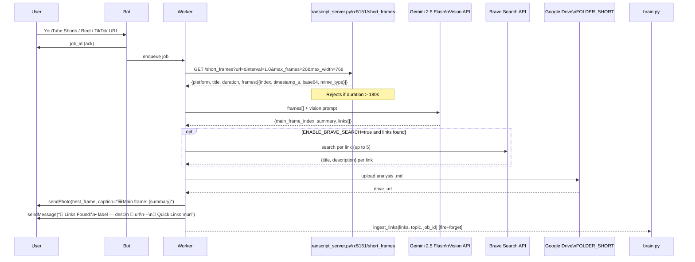
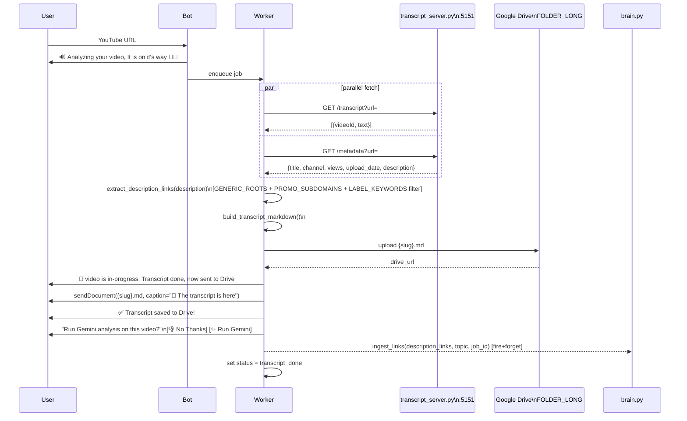
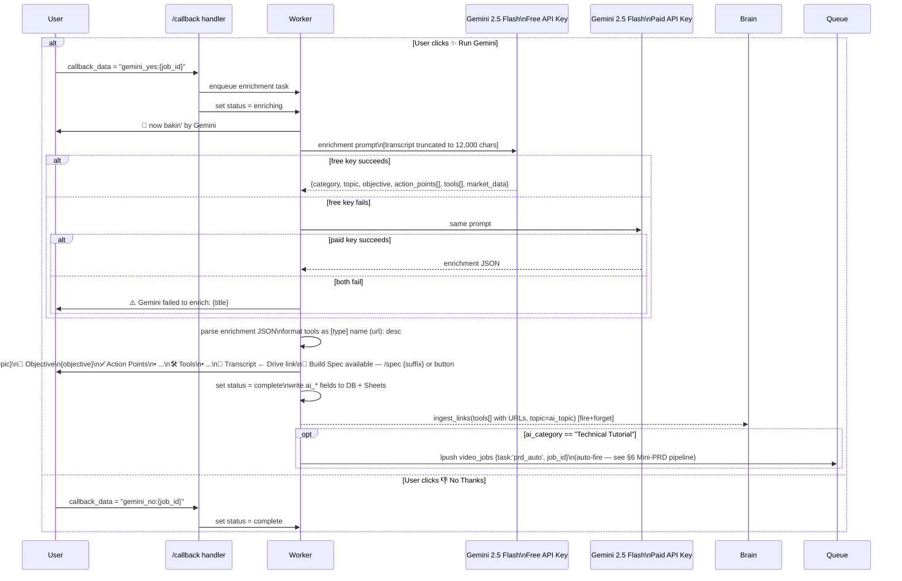
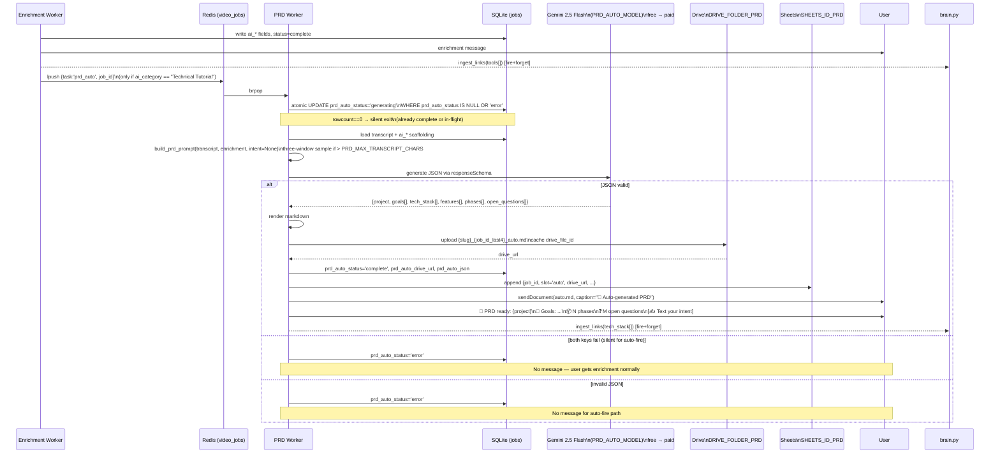
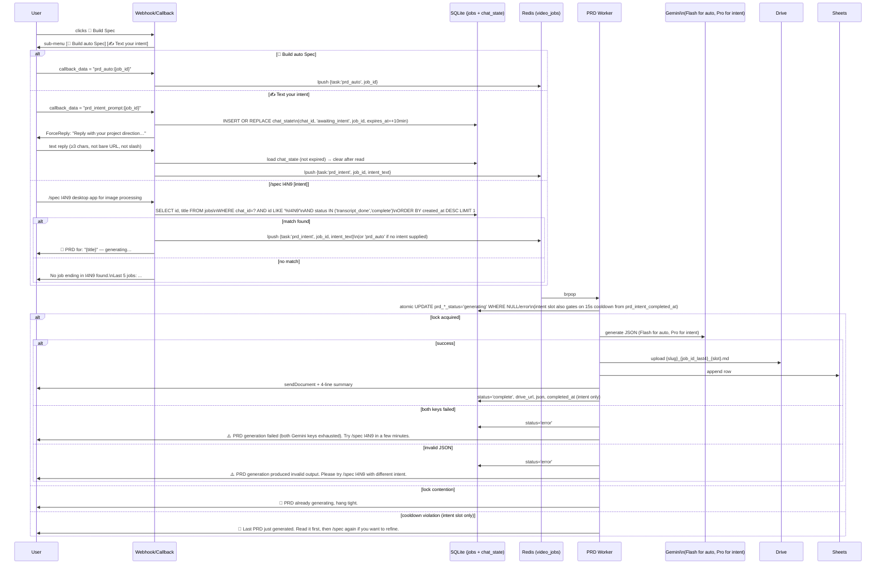
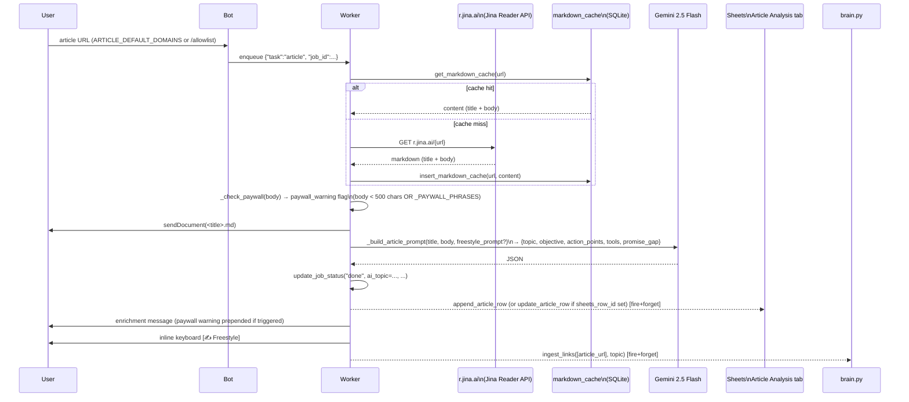
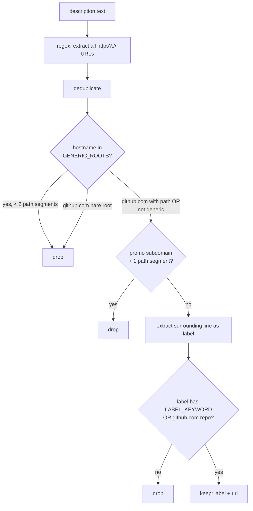

# Video Intelligence Gateway — Architecture

**Version:** 2.3  
**Last Updated:** 2026-07-18  
**Status:** Updated for repo + document pipelines, the web dashboard ("The Operator's Console", Ownix design system), dashboard job submission, the ops bot, and link identity/tags. Diagrams in §1–§8 describe the Telegram pipelines and remain accurate for that scope; §6b–§6d cover the newer surfaces.

---

## 1. System Architecture — High Level



---

## 2. URL Routing

The webhook handler performs routing before creating a job. No job is created for rejected URLs.

```mermaid
flowchart TD
    IN[Incoming URL] --> R1{youtube.com/shorts/ ?}
    R1 -->|yes| SHORT[short pipeline]
    R1 -->|no| R2{instagram.com/reel/ ?}
    R2 -->|yes| SHORT
    R2 -->|no| R3{tiktok.com/@*/video/ ?}
    R3 -->|yes| SHORT
    R3 -->|no| R4{youtube.com/watch ?}
    R4 -->|yes| LONG[long pipeline]
    R4 -->|no| R5{youtu.be/ ?}
    R5 -->|yes| LONG
    R5 -->|no| R6{github.com/owner/repo ?}
    R6 -->|yes| REPO[repo pipeline]
    R6 -->|no| R7{path ends .pdf ?}
    R7 -->|yes| DOC[document pipeline]
    R7 -->|no| R8{host in ARTICLE_DEFAULT_DOMAINS\nor allowed_domains for this chat?}
    R8 -->|yes| ART[article pipeline]
    R8 -->|no| REJ[rejected\nno job created\nbot replies unsupported]
```

| Pattern                         | Pipeline | Notes                 |
| ------------------------------- | -------- | --------------------- |
| `youtube.com/shorts/{id}`       | short    | YouTube Shorts        |
| `instagram.com/reel/{id}`       | short    | Instagram Reels       |
| `tiktok.com/@{user}/video/{id}` | short    | TikTok video          |
| `youtube.com/watch?v={id}`      | long     | Standard YouTube      |
| `youtu.be/{id}`                 | long     | YouTube short-link    |
| `github.com/{owner}/{repo}`     | repo     | Gists / enterprise hosts rejected (ADR-0014) |
| any URL with path ending `.pdf` | document | Also PDF file uploads (ADR-0023) |
| domain in `ARTICLE_DEFAULT_DOMAINS` or per-chat `allowed_domains` | article | Substack, Medium, dev.to, etc. |
| `instagram.com/p/{id}`          | rejected | Carousel / photo post |
| anything else                   | rejected | No job created        |

---

## 3. Job State Machine



**Job ID format:** `YYYYMMDD_HHMMSS_XXXX` (e.g. `20260516_143022_A3F9`)

**Mini-PRD slot lifecycles** (independent of `jobs.status`; tracked on `prd_auto_status` / `prd_intent_status` columns):



Auto-fire (tail-call from enrichment when `ai_category == "Technical Tutorial"`) is silent on failure; manual triggers (button or `/spec`) surface failures to the user. See PRD §14.

---

## 4. Short Video Pipeline — Detail



**Frame service platform detection** (inside `transcript_server.py`):

- `extractor_key == "Youtube"` + `/shorts/` in URL → `youtube_shorts`
- `extractor_key == "TikTok"` → `tiktok`
- `extractor_key == "Instagram"` → `instagram_reels`

---

## 5. Long Video Pipeline — Detail

### Phase 1: Transcript (runs immediately)



### Phase 2: Gemini Enrichment (user-triggered)



**Gemini enrichment prompt structure** (from `scripts/update-workflow-add-topic.js`):

1. **STEP 1 — CLASSIFICATION:** A) Technical Tutorial / B) Market Analysis / C) General Educational
2. **STEP 2 — TOPIC:** 2–5 concrete words
3. **STEP 3 — EXTRACTION RULES:** Different focus per category (architecture/libraries vs tickers/price targets vs summary)
4. **STEP 4 — OUTPUT FORMAT:** Strict JSON `{category, topic, objective, action_points[], tools[], market_data}`

---

## 6. Mini-PRD Pipeline — Detail

Third AI call on the long-video pipeline. Produces a structured implementable spec (Project / Goals / Tech Stack / Features / Phases / Open Questions) from the transcript, optionally biased by user-supplied intent. Two slots per job: `prd_auto` (extraction; auto-fired on Technical Tutorial) and `prd_intent` (user-directed; manual). See PRD §14 for the full spec.

### Auto-fire path (tail-call from enrichment)



### Manual path (📐 Build Spec button OR `/spec` command)



### Boot-time reaper

Released at worker startup to clear orphaned `'generating'` rows from crashed runs:

```sql
UPDATE jobs SET prd_auto_status='error'
WHERE prd_auto_status='generating' AND updated_at < datetime('now','-10 minutes');
UPDATE jobs SET prd_intent_status='error'
WHERE prd_intent_status='generating' AND updated_at < datetime('now','-10 minutes');
```

### Truncation strategy (transcript > `PRD_MAX_TRANSCRIPT_CHARS = 60_000`)

Three-window sample: first 20k + middle 20k + last 20k, joined with `\n\n[...truncated...]\n\n` markers. Preserves the tutorial arc so phase ordering reflects intro → core → deployment. Truncation markers are model signal — model can populate `open_questions[]` with "implementation details between Phase 1 and Phase 2 may not be captured."

---

## 6a. Article Pipeline — Detail



**Freestyle re-run path:**

```
[user taps ✍️ Freestyle] → template_freestyle:{job_id} callback
  → arm chat_state(awaiting_freestyle, job_id)
  → ForceReply: "What should Gemini focus on?"
[user types prompt]
  → store jobs.freestyle_prompt → clear chat_state
  → enqueue {"task":"article", "job_id": same_job_id}
  → article.run: markdown_cache hit (no second Jina call)
  → update_article_row (in-place Sheets overwrite via sheets_row_id)
```

---

## 6b. Repo Pipeline (ADR-0014, ADR-0021)

`github.com/<owner>/<repo>` URLs route to `processors/repo.py`:

1. `services/github.py` builds a REST bundle — README + prioritized file tree + package manifests + stars/forks/language (Redis-cached 24h, `github_meta:{owner}/{repo}`).
2. Gemini 2.5 Flash structured analysis: tagline, tech stack, developer use-cases, educational concepts with file-pointed curriculum hooks.
3. Output: `.md` document → Drive, row → `Repo Analysis` Sheets tab, links → Brain, Telegram delivery.

Archived and missing-README repos are handled; gists and enterprise hosts are rejected at routing. Repos extracted from *other* results (photo OCR, short-video links) are offered as follow-up repo jobs via `services/repo_followup.py`, which calls the shared `create_and_enqueue_job()` core (ADR-0033).

---

## 6c. Document Pipeline (ADR-0023)

PDF documents arrive as file uploads or `.pdf` URLs (`services/pdf_intake.py` owns the trust boundary: magic-byte/size validation, SSRF guard, capped fetch):

1. liteparse text extraction (`services/parse.py`), content-addressed GCS cache — `documents/<sha256>.pdf` source, `parsed/<sha256>.txt` extraction cache shared across tenants.
2. Gemini enrichment: title, author, document type, key points, references, tools.
3. Telegram delivery: parsed `.txt` document + enrichment summary. No Drive upload.

The same parse machinery backs the dashboard **Doc Parser** page via `src/api/parsed.py` (ADR-0029), with outputs in the `document_outputs` table.

---

## 6d. Web Dashboard & Ops Bot

The **web dashboard** ("The Operator's Console", Ownix design system — ADR-0034) is a Next.js 14 App Router app under `web/`, served by Vercel in production, talking to the FastAPI dashboard API (`src/api/`) through the session-cookie middleware (`src/auth/`, ADR-0016). Pages: feed (server-resolved thumbnails, ADR-0025), job detail, brain graph, spaces, prompts, controls, doc-parser (ADR-0029), plus a public landing funnel, restricted-mode read-only preview (ADR-0035), and invite-gated onboarding (ADR-0031). The dashboard also **submits** jobs (`POST /api/jobs`, ADR-0032) through the shared job-creation core (ADR-0033) — it is no longer read-only. Full spec: `WEB-PRD.md`.

The **ops bot** (ADR-0036) is a second Telegram bot on `/webhook/ops` (`services/ops_bot.py`) giving the operator user/invite administration — approving invite requests surfaced by `services/invite_notifications.py` — without touching the main bot.

---

## 7. Description Link Extraction

Runs during Long Pipeline Phase 1 on the video description field. Ported from `scripts/extract-description-links.js`.



**GENERIC_ROOTS** (18 domains): `github.com`, `claude.ai`, `openai.com`, `twitter.com`, `x.com`, `discord.gg`, `discord.com`, `linkedin.com`, `youtube.com`, `youtu.be`, `patreon.com`, `ko-fi.com`, `buymeacoffee.com`, `bit.ly`, `t.co`, `linktr.ee`, `instagram.com`, `facebook.com`, `tiktok.com`, `reddit.com`

**PROMO_SUBDOMAINS**: `get`, `try`, `go`, `link`, `ref`, `promo`, `deal`, `offers`, `start`

**LABEL_KEYWORDS**: `free`, `resource`, `github`, `repo`, `guide`, `apis`, `markdown`, `by`, `+`, `docs`, `self`, `hosted`, `source`

GitHub repos (any path beyond bare root) always pass regardless of label.

---

## 8. Second Brain Architecture

```mermaid
graph TB
    subgraph "Ingestion (fire+forget from all four sources)"
        SRC1[Short pipeline\nGemini Vision links]
        SRC2[Long Phase 1\ndescription links]
        SRC3[Long Phase 2\nenrichment tools URLs]
        SRC4[Long Phase 3\nPRD tech_stack URLs\nboth slots]
        SRC1 --> IL
        SRC2 --> IL
        SRC3 --> IL
        SRC4 --> IL
        IL[brain.ingest_links\nlinks, topic, source_job_id]
        DEDUP{URL in links\ntable?}
        IL --> DEDUP
        DEDUP -->|yes: dedup hit| UPD[seen_count += 1\nlast_seen_at = now\nDO NOT touch updated_at\nrewrite .md on Drive]
        DEDUP -->|no: new link| TR[Title Resolution\n1. existing title\n2. GitHub: owner/repo\n3. strip TLD\n4. Gemini title-gen\n5. fallback to URL hint]
        TR --> EMB[text-embedding-004\nDIM=768\nnumpy float32.tobytes]
        EMB -->|fail| NULL[embedding = NULL\nrefresh worker repairs]
        EMB -->|ok| SIM[cosine similarity\nvs full corpus\ntop-3 score ≥ BRAIN_MIN_SCORE]
        SIM --> MD[write Obsidian .md\nto DRIVE_FOLDER_BRAIN]
        MD --> INS[INSERT into links table\ndrive_file_id cached]
    end

    subgraph "Refresh Worker (APScheduler 0 9 * * 0,3)"
        RW[refresh_stale_links]
        RW --> BATCH[effective_batch =\nmin 500 max BRAIN_REFRESH_BATCH corpus//20]
        BATCH --> PICK[pick: NULL embedding or drive_file_id first\nthen oldest updated_at]
        PICK --> REEMB[re-embed if NULL]
        REEMB --> RERANK[recompute top-3 similarity\nagainst full corpus]
        RERANK --> REWRITE[files.update via cached drive_file_id\nupdate updated_at]
    end

    subgraph "Rebuild Command"
        RBT[/rebuild-graph\nPOST /links/rebuild]
        LOCK{_rebuild_lock\nheld?}
        RBT --> LOCK
        LOCK -->|yes| BUSY[reply: rebuild in progress]
        LOCK -->|no| BG[asyncio.create_task\nrewrite all .md files\nreply: Graph rebuilt — N nodes]
    end

    subgraph "Search"
        FQ[/find query\nGET /links/search?q=]
        FQ --> QEMB[embed query\ntext-embedding-004]
        QEMB --> QSIM[cosine similarity\nvs all non-NULL embeddings]
        QSIM --> TOP[top-5 score ≥ BRAIN_MIN_SCORE]
        TOP -->|results| FMT["🔗 *title* — domain\n   Topic: ...\n   Score: 0.91"]
        TOP -->|no results| NONE[No relevant links found in your brain.]
    end
```

### Obsidian `.md` Node Format

```markdown
# {title}

**URL:** {url}
**Topic:** {topic}
**Source video:** {source*video_url}
**Source report:** {source_drive_url} ← *(unavailable)\_ if NULL
**Seen:** {seen_count} time(s)
**Added:** {created_at}
**Last seen:** {last_seen_at}

## Related

- [[{related_title_1}]]
- [[{related_title_2}]]
- [[{related_title_3}]]
```

Obsidian reads `[[wiki-links]]` as graph edges. User opens `DRIVE_FOLDER_BRAIN` as vault via Google Drive desktop app.

---

## 9. `transcript_server.py` — Local Service

Existing Flask+Waitress server on port 5151. **Not rewritten** — called by the Python service as a sidecar.

| Route           | Method | Input                                            | Output                                                                                                                          |
| --------------- | ------ | ------------------------------------------------ | ------------------------------------------------------------------------------------------------------------------------------- |
| `/transcript`   | GET    | `?url=`                                          | `[{videoId, text}]` or `[{error:{type,message}}]`                                                                               |
| `/metadata`     | GET    | `?url=`                                          | `{title, channel, views, upload_date, description}`                                                                             |
| `/short_frames` | GET    | `?url=&interval=1.0&max_frames=20&max_width=768` | `{platform, title, duration, video_id, frame_count, frames:[{index,timestamp_s,base64,mime_type}]}` or `{error:{type,message}}` |
| `/health`       | GET    | —                                                | `{status:"ok"}`                                                                                                                 |

**Networking:**

- Short frames: `FRAME_SERVICE_URL` (default `http://10.0.0.4:5151` — LAN IP used by n8n)
- Transcript/metadata: `TRANSCRIPT_SERVICE_URL` (default `http://host.docker.internal:5151` — Docker alias)

Both are env-var configurable. The discrepancy (LAN IP vs Docker alias) is inherited from the n8n workflow and should be unified to a single env var when the Python service runs outside Docker.

---

## 10. Component Map

```
src/
├── main.py              # FastAPI app, APScheduler (brain refresh Sun/Wed 09:00 UTC)
├── worker.py            # Task dispatch loop, boot-time reapers
├── database.py          # SQLite schema + PRAGMA user_version migrations + all CRUD
├── brain.py             # Second Brain: ingest / search / rebuild / refresh
├── queue.py             # Redis brpop/lpush wrapper
├── config.py            # pydantic-settings, all env vars
├── api/                 # Dashboard JSON API (session-gated)
│   ├── jobs.py          # List / stats / detail / annotations / tags + POST /api/jobs (ADR-0032)
│   ├── brain.py         # /api/brain/search + /api/brain/rebuild
│   ├── spaces.py        # Spaces CRUD + URLs + context blobs + export
│   ├── templates.py     # User-defined enrichment templates (ADR-0019)
│   ├── controls.py      # Allowed/ignored domains + tags CRUD
│   ├── parsed.py        # Doc Parser page API (ADR-0029)
│   ├── preview.py       # Restricted-mode read-only preview (ADR-0035)
│   ├── auth.py          # Telegram Login Widget → session cookie
│   └── google_oauth.py  # Per-user Google OAuth connect (ADR-0030)
├── auth/
│   ├── hmac_verify.py   # Pure Login-Widget HMAC verifier
│   ├── session.py       # Redis opaque session store (ADR-0016)
│   ├── middleware.py    # /api/* session gate
│   └── telegram_miniapp.py  # Mini App initData verification
├── processors/
│   ├── short_video.py   # Frames → Vision → Brave → Drive + guaranteed transcript tail (ADR-0020)
│   ├── long_video.py    # Transcript + metadata → Drive → Phase 1
│   ├── enrichment.py    # Gemini text enrichment, Phase 2
│   ├── prd.py           # Mini-PRD: run_auto / run_intent / run_auto_resend
│   ├── article.py       # Jina → cache → paywall → Gemini → Sheets → Brain
│   ├── repo.py          # GitHub bundle → Gemini structured analysis → Sheets → Brain
│   └── document.py      # PDF parse (liteparse) → GCS cache → Gemini enrichment
├── services/            # One module per external surface — see MODULE_MAP.md for the full table
│   ├── gemini_client.py # free→paid fallback, GeminiUnavailableError
│   ├── jobs.py          # create_and_enqueue_job() shared core (ADR-0033)
│   ├── ops_bot.py       # Ops bot command handlers (ADR-0036)
│   ├── github.py        # GitHub metadata + Redis cache
│   ├── storage.py       # GCS content-addressed blob store
│   └── …                # drive, sheets, jina, brave, transcript, frames, gemini, gemini_photo,
│                        # google_auth/tokens/workspace, pdf_intake, parse, space_export,
│                        # job_recovery, repo_followup, invite_notifications
├── telegram/
│   ├── webhook.py       # POST /webhook — URL routing, chat_state FSM, dispatch tables
│   └── sender.py        # sendMessage, sendDocument, sendPhoto, ForceReply, inline keyboards
├── utils/               # validators (detect_pipeline), markdown, logger
├── templates.py         # PROMPT_TEMPLATES registry
├── analysis.py          # extract_key_phrases
└── validation.py        # validate_template_choice

tests/                   # pytest + pytest-asyncio
transcript_server.py     # Flask+Waitress sidecar :5151 (yt-dlp + ffmpeg + youtube-transcript-api)

web/                     # Next.js 14 dashboard — "The Operator's Console" (Ownix design system)
├── app/(dashboard)/     # feed, brain, spaces, prompts, controls, jobs/[id], doc-parser
├── app/                 # landing, login, privacy, terms, restricted, mini
├── middleware.ts        # Session gate
├── components/<area>/   # shell / ui / feed / doc-parser / brain / spaces / landing / svg
└── lib/                 # data hooks, mocks (MSW), utilities
```

---

## 11. Key Design Decisions

### D1 — Direct Telegram API over library

`httpx` + raw Bot API calls. No wrapper library (python-telegram-bot, aiogram, etc.).

- **Why:** Full control over payload structure, no version-lock risk, simpler debugging (HTTP logs).
- **Trade-off:** More boilerplate for `sendDocument`, `sendPhoto` vs `sendMessage`.
- **Switch when:** Building a multi-bot system or needing complex conversation state management.

### D2 — SQLite over PostgreSQL

Embedded, zero-config, single file. `aiosqlite` for async access.

- **Why:** Personal/portfolio tool. <10k jobs/day. No separate DB server in Docker Compose.
- **Trade-off:** WAL mode required for concurrent readers; no row-level locking.
- **Switch when:** >10k jobs/day, multiple API replicas writing simultaneously, or need JSONB/full-text search.

### D3 — Redis queue over asyncio.Queue

Redis `brpop`/`lpush` with `asyncio.Queue` as documented fallback.

- **Why:** Queue survives worker restarts; supports multiple worker containers.
- **Trade-off:** Extra Docker service.
- **Switch to asyncio.Queue when:** Single-container deployment, no restart risk, simplicity preferred.

### D4 — Two-phase long video pipeline (user-gated Gemini)

Transcript upload happens immediately; Gemini enrichment only runs on user consent.

- **Why:** Gemini enrichment costs quota and takes time. Many videos are worth reading the transcript without needing AI analysis. The n8n workflow made this the UX pattern — preserving it.
- **Trade-off:** Requires callback handler, `transcript_done` state, storing transcript on job row.
- **Remove gate when:** Quota is cheap enough to run enrichment automatically on all videos.

### D5 — Gemini free key → paid key fallback (enrichment only)

Enrichment tries `GEMINI_FREE_API_KEY` first, then `GEMINI_PAID_API_KEY`. Double failure → user alert.

- **Why:** Free tier handles most traffic; paid key is a safety net for rate-limited bursts.
- **Note:** The n8n workflow had an Anthropic fallback (`update-workflow-anthropic-fallback.js`). This is **not ported** — the Python replacement uses a second Gemini key instead.

### D6 — Separate Drive folders per pipeline, one Sheets workbook with named tabs

`DRIVE_FOLDER_SHORT` / `DRIVE_FOLDER_LONG` / `DRIVE_FOLDER_BRAIN` / `DRIVE_FOLDER_PRD`, and a single `GOOGLE_SHEETS_ID` workbook with five tabs (`YouTube Transcript Index`, `Short Video Analysis`, `Article Analysis`, `Repo Analysis`, `mini PRD`) — tab routing enforced in `services/sheets.py` (ADR-0013).

- **Why:** Drive folders preserve the existing n8n structure; consolidating Sheets into one workbook replaced three `SHEETS_ID_*` env vars with named tabs, so adding a pipeline no longer adds config.
- **Switch when:** Merging pipelines into a unified output schema.

### D7 — Second Brain as fire-and-forget

`asyncio.create_task(brain.ingest_links(...))` — pipeline does not await.

- **Why:** Brain ingestion (embedding API call + Drive write) is slow. Blocking the pipeline on it would delay the user's Telegram response.
- **Trade-off:** Data loss if the worker crashes mid-ingestion. Acceptable for single-user portfolio tool.
- **Harden when:** Tool goes multi-user. Add `brain_pending` table + drain worker for crash recovery.

### D8 — numpy cosine similarity over vector DB

In-memory numpy matrix for embedding similarity. No Pinecone, Weaviate, etc.

- **Why:** 768 floats × 10k links = ~30MB. Easily fits in memory. Zero infra overhead.
- **Switch when:** Corpus exceeds ~100k links, or per-user partitioning is needed with concurrent queries.

### D9 — Mini-PRD as Phase 3 of the long-video pipeline (Gemini Flash + Pro, two-slot model)

Adds a third AI call that produces a structured implementable spec (Project / Goals / Tech Stack / Features / Phases / Open Questions) from the transcript. Two slots per job: `prd_auto` (Flash, fires automatically on Technical Tutorial classification) and `prd_intent` (Pro, user-directed via 📐 button or `/spec` command).

- **Why two slots, not N:** The auto slot is the canonical extraction (worth preserving). The intent slot is a working document users iterate on — they want the latest, not a graveyard. Two fixed columns beat a child table for this shape.
- **Why Flash for auto, Pro for intent:** Auto fires for every Technical Tutorial — Flash keeps default cost low and latency ~3s. Intent represents explicit user investment — Pro's reasoning improves phase ordering at the cost of ~10s latency, which the user is already prepared to wait for.
- **Why per-slot status columns (not a child table or new main status):** The atomic `UPDATE-WHERE-NULL` on a column gives the race lock for free, doesn't pollute the main job state machine (which has to keep flowing as PRD runs in parallel), and survives worker restarts via a 10-minute boot reaper.
- **Why transcript-only (frames flag for v2):** A clean transcript captures 80–90% of a tutorial's information. Frames add the last 10–20% at large cost (download + multimodal API). The `PRD_INCLUDE_FRAMES=false` escape hatch keeps the option open without committing to the infrastructure cost.
- **Trade-off:** Three AI calls per long video (transcript fetch is not AI; enrichment + auto PRD + optional intent PRD = up to 3). Cost-bounded by the 15s intent cooldown and the auto-fire being silent on failure.
- **Switch when:** If users consistently iterate >5 times on intent slot for the same video, reconsider the two-slot-vs-N decision (Q5 from grilling). If Flash auto PRDs are visibly thin, flip `PRD_AUTO_MODEL=gemini-2.5-pro` (one env change).

---

## 12. Comparison with n8n Workflow

| Aspect             | n8n Workflow                   | Python Service                                      |
| ------------------ | ------------------------------ | --------------------------------------------------- |
| Component count    | 60+ visual nodes               | ~45 Python modules + Next.js dashboard              |
| State management   | Google Sheets                  | SQLite (`jobs` + `links`)                           |
| Gemini fallback    | Anthropic `claude-sonnet-4-5`  | Paid Gemini API key                                 |
| Transcript service | `host.docker.internal:5151`    | `TRANSCRIPT_SERVICE_URL` env var                    |
| Frame service      | `10.0.0.4:5151` (hardcoded IP) | `FRAME_SERVICE_URL` env var                         |
| URL routing        | Inline JS in nodes             | `detect_pipeline()` in `validators.py`              |
| Observability      | Limited                        | structlog JSON                                      |
| Version control    | Single JSON blob               | Standard git                                        |
| Testing            | Manual                         | Unit + integration                                  |
| Second Brain       | Not present                    | `brain.py` module                                   |
| Mini-PRD           | Not present                    | `processors/prd.py` — two-slot, auto-fire + `/spec` |
| Repo / PDF pipelines | Not present                  | `processors/repo.py` + `processors/document.py`     |
| Web dashboard      | Not present                    | Next.js 14 under `web/` (Vercel) + `src/api/`       |
| User administration | Not present                   | Ops bot (`/webhook/ops`, ADR-0036) + invite gate    |

---

## 13. Scalability

### Current ceiling (single-machine, 3 workers)

- ~200 jobs/hour
- ~10,000 jobs/day before SQLite write contention

### Bottlenecks in order of likelihood

1. **Gemini rate limits** → queue with rate limiter per API key
2. **`transcript_server.py` CPU** (yt-dlp + ffmpeg are CPU-bound) → run multiple instances
3. **SQLite write lock** → migrate to PostgreSQL (`aiosqlite` → `asyncpg`, 2-line config change)
4. **Worker count** → add worker containers (Redis supports N workers natively)

### Scaling path

```
Stage 1 (current): 1 API container + 1 worker + Redis + SQLite
Stage 2: 1 API + 3 workers + Redis + SQLite (WAL mode)
Stage 3: 2 API (nginx LB) + N workers + Redis + PostgreSQL
Stage 4: managed Redis + PostgreSQL RDS + containerised transcript_server.py fleet
```

---

**Diagram Version:** 2.3  
**Last Updated:** 2026-07-18
